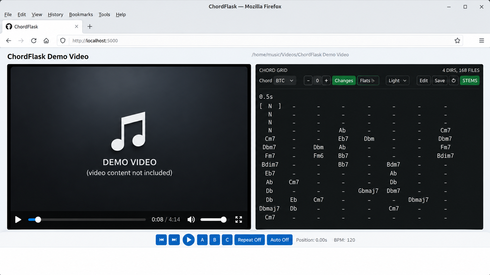

# ChordFlask

ChordFlask is for exploring your own music collection — audio and video — with chords. Browse your
audio tracks and music videos, play whatever catches your interest, and analyze only the pieces you
want. Completed analyses stay available, so your collection gradually becomes a reusable
chord-and-beat library without having to process everything up front.


ChordFlask is a free, self-hosted Linux chord analysis tool for local audio and video
collections. It analyzes chords and beats in MP3, MP4, and WebM files, supports
fast on-demand and batch analysis, and shows the results in sync while you play
the media in the browser. The displayed chords can be transposed, corrected,
compared, and exported as Markdown or PDF. Playback and analysis run locally;
media and analysis data are never uploaded. The optional `chordflask-genlyrics`
command uses same-stem LRC or embedded lyrics when available and can perform an
explicit on-demand lyrics lookup via LRCLIB.

ChordFlask supports Linux x86_64 on Ubuntu 24.04+, Linux Mint 22+, and Debian
13+ (CPython 3.12–3.14). Native Windows is not supported; Windows users can run
ChordFlask under WSL2 (tested) and open the local web interface from the
Windows browser at localhost.

<!-- standalone-download:start -->
## Download

A prebuilt Linux x86_64 bundle is available for users who do not want to
build ChordFlask themselves:

**[Download chordflask-mint22-x86_64-py3.12-v0.9.16.tar.gz](https://github.com/bkl2000/chordflask/releases/download/v0.9.16/chordflask-mint22-x86_64-py3.12-v0.9.16.tar.gz)**

The Mint 22 build is also suitable for Ubuntu 24.04, since Linux Mint 22 is based on Ubuntu 24.04.

Built from the same ChordFlask release source as the public release. FFmpeg and
Vamp plugin binaries are not bundled; see the portable bundle guide for
requirements.
<!-- standalone-download:end -->

## Quick start

There are two ways to run ChordFlask:

- **Prebuilt standalone bundle (simplest).** Download the prebuilt Linux x86_64
  standalone bundle from [Download](#download), unpack it, and run the bundled
  installer and launcher. See the
  [standalone bundle guide](docs/STANDALONE.md) for the complete workflow.
- **From source.** Clone the repository, install the runtime dependencies,
  install the Vamp plugins, and start ChordFlask as shown below.

### Run from source

On a fresh Debian 13 or WSL2 system the Python interpreter, compiler toolchain,
and download tools are not preinstalled, so install the system packages first:

```bash
sudo apt update
sudo apt install --no-install-recommends \
  git curl ffmpeg pkg-config vamp-plugin-sdk python3-venv python3-dev \
  build-essential libasound2-dev libcairo2-dev
```

Then clone ChordFlask, create its private Python environment, install the two
required audio-analysis plugins, and start it:

```bash
git clone https://github.com/bkl2000/chordflask.git
cd chordflask
make setup-runtime
make plugins
scripts/chordflask
```

Open <http://localhost:5000> and use **Roots** to select a directory with
MP3, MP4, or WebM files. Stop ChordFlask with `Ctrl+C` in the terminal.

The Make targets use `~/.venvs/chordflask` automatically; you do not need to
activate that environment. If a command fails, see
[Troubleshooting](#troubleshooting).

BTC chord analysis and Demucs stem separation are optional. Install them only
if needed; both benefit substantially from a CUDA-capable GPU. The standard
ChordFlask workflow does not require either.

## Why ChordFlask

ChordFlask is a small local-first tool for working with a music collection you
already have. Its emphasis is the workflow around chord analysis rather than a
claim of uniquely accurate recognition: browse a directory, play any file, and
generate reusable chord data only when it is useful.

Compared with hosted services such as Chordify, ChordFlask takes a different
trade-off: it is free, runs locally, works directly with your own audio and
video collection, and is designed for fast on-demand and batch processing.
Chord recognition quality is generally lower than mature commercial services,
so the generated chords should be treated as an approximate starting point
rather than an authoritative transcription.

It is especially useful for playing along or improvising with songs from your
own collection without searching for separate chord sheets or tabs.

This local, on-demand workflow is the main reason ChordFlask exists:

- prepare selected parts of a collection in bounded background batches;
- keep each completed analysis beside the media for later sessions; and
- continue browsing and playing while other files are analyzed.

**Automatic chord transcription is approximate, especially with dense mixes or
unusual harmony.** The current Chordino-based result is intended as a useful
starting point for orientation and practice, not as an authoritative score.
When the result is close enough, this workflow can avoid repeated manual setup.
When it is not, the original remains intact while an Edited version can be
corrected beat by beat.

## Using ChordFlask

### Command-line tools

ChordFlask provides a player and a small set of command-line tools.
Chordino is the built-in, default analyzer.

| Command | Purpose |
| --- | --- |
| `chordflask` | Interactive player |
| `chordflask-analyze` | Generate chord/beat analysis |
| `chordflask-demucs` | Generate optional stems |
| `chordflask-export` | Export analysis data |
| `chordflask-genlyrics` | Use embedded or fetched lyrics to create a local `.cho` song sheet |
| `chordflask-maintain` | Inspect/clean generated data |

The two supported setups are intentionally different:

**Source / virtualenv**

```bash
make all
cp scripts/chordflask scripts/chordflask-{analyze,demucs,export,genlyrics,maintain} ~/bin/
```

When upgrading from 0.9.x, copy these launchers again: older copied launchers
still target the pre-package source layout.

```bash
cp scripts/chordflask \
   scripts/chordflask-{analyze,demucs,export,genlyrics,maintain} \
   ~/bin/
```

Then run `chordflask` from any directory (once `~/bin` is on your `PATH`). The
source launchers locate the configured ChordFlask virtual environment
themselves, so activating the venv is not normally required.

**Standalone bundle**

Unpack the release archive and run the launcher that ships beside the binary:

```bash
tar -xzf <release-archive>
cd <standalone-dir>
./install_vamp.sh
./chordflask.sh
```

`./chordflask.sh` launches the sibling `./chordflask` binary. See
[docs/STANDALONE.md](docs/STANDALONE.md) for the complete workflow.

In a source checkout the same commands are also available under `scripts/`:

```bash
# Start the player / web app
scripts/chordflask

# Analyze with the built-in Chordino analyzer
scripts/chordflask-analyze song.mp4
scripts/chordflask-analyze /music/videos

# Preview without changing anything, or replace an existing analysis
scripts/chordflask-analyze --dry-run /music/videos
scripts/chordflask-analyze --replace song.mp4

# Export leadsheets (Markdown, PDF, and ChordPro .cho)
scripts/chordflask-export song.mp4
scripts/chordflask-export --format markdown song.mp4
scripts/chordflask-export --format pdf song.mp4
scripts/chordflask-export --format chordpro song.mp4

# Fetch synchronized lyrics into a same-stem ChordPro sidecar
scripts/chordflask-genlyrics song.mp3
scripts/chordflask-genlyrics /music/album
scripts/chordflask-genlyrics --tag "Artist Song Title" song.mp3
scripts/chordflask-genlyrics --track btc song.mp3
scripts/chordflask-genlyrics --force --track user_edited song.mp3

# Maintenance
scripts/chordflask-maintain doctor
scripts/chordflask-maintain validate /music/videos
scripts/chordflask-maintain migrate-schema /music/videos
scripts/chordflask-maintain storage report /music/videos
```

Details are in [docs/ANALYSIS.md](docs/ANALYSIS.md) (analysis and export),
[docs/MAINTENANCE.md](docs/MAINTENANCE.md) (maintenance), and
[docs/HELPERS.md](docs/HELPERS.md) (the underlying helper modules).

### Optional automatic beat-grid correction

Automatic beat-grid correction is disabled by default. To try it for newly
requested analyses, start ChordFlask or the analysis helper with:

```bash
CHORDFLASK_AUTO_CORRECT_BEAT_GRID=1 scripts/chordflask
CHORDFLASK_AUTO_CORRECT_BEAT_GRID=1 scripts/chordflask-analyze --replace song.mp4
```

Disable it again by omitting the variable, unsetting it, or setting it to `0`:

```bash
unset CHORDFLASK_AUTO_CORRECT_BEAT_GRID
# or
CHORDFLASK_AUTO_CORRECT_BEAT_GRID=0 scripts/chordflask
```

Accepted true values are `1`, `true`, `yes`, and `on`; accepted false values
are `0`, `false`, `no`, and `off` (case-insensitive). Existing analysis files
are loaded unchanged even while the option is enabled. Use an explicit
replacement analysis, as in the second command above, to process an existing
song again.

When a newly detected beat sequence passes the conservative constant-tempo,
drift, section, and one-to-one assignment checks, the regular
`qm_barbeattracker` rhythm track contains the corrected grid and
`qm_barbeattracker_original` preserves the detected timestamps and beat
numbers. Either track can be selected with the existing rhythm-track selector.
If the checks reject the sequence, no extra track or metadata is written and
the detected beats remain byte-for-byte values in memory. Old files containing
only the regular track remain valid and need no migration.

The checks require at least 16 beats, reject discontinuous beat-number cycles,
require every adjacent timestamp to remain an unambiguous single-beat match,
limit local median-tempo variation to 4%, and limit global and sectional grid
error. These checks prevent obvious drift and tempo changes; regular timestamps
alone cannot establish the musically correct phase or distinguish correct
tempo from half/double tempo.

The existing programmatic `AudioAnalyzer(quantize_beats=True)` option remains
forced quantization with its previous first-beat/rounded-BPM behavior. It is
different from automatic correction; enabling it together with
`auto_correct_beat_grid=True` is an error rather than an implicit precedence
choice.

### Optional BTC analyzer

Chordino is the built-in default analyzer. The optional BTC analyzer runs a
pretrained model in a separate environment and adds its result as an
additional `btc` chord track, without touching the Chordino track. Install and
use it explicitly:

```bash
make setup-btc BTC_ACKNOWLEDGE_WEIGHTS=1   # one-time: environment + model download
make btc-check                             # diagnose the runtime (CPU/CUDA, model)

scripts/chordflask-analyze --analyzer btc song.mp4
```

Chordino and BTC are stored as separate tracks; switch between them with the
track selector next to the chord grid. BTC never replaces Chordino and is not
part of the standalone bundle. Its separate runtime supports Python 3.12–3.14
and uses PyTorch 2.10.0 with CUDA 12.8 wheels (with automatic CPU fallback).
See [BTC runtime compatibility](chordflask_btc/model/README.md#runtime-compatibility)
for interpreter overrides and existing-venv upgrades.

### Optional Demucs stems / karaoke & practice

Demucs is an optional, separate runtime that splits a song into four parts —
**Vocals**, **Drums**, **Bass**, and **Other**. ChordFlask works normally
without it, and the normal app and standalone bundle keep the heavy
Demucs/Torch stack external; only the small, dependency-free producer is
bundled.

**Quick start**

```bash
# one-time optional environment setup
make setup-demucs
make demucs-check

# prepare every supported song in one directory (run once)
scripts/chordflask-demucs ~/Music
```

Then start ChordFlask normally and load one of the processed songs. ChordFlask
finds the generated stem data automatically and shows a small **STEMS**
control:

```text
[STEMS]  [Voc | 100] [Drm | 100] [Bass | 100] [Oth | 100]
```

- **STEMS** switches the player to separated audio. The original audio (and
  video) stays the master timeline; the four FLAC stems follow it.
- Click a stem name (**Voc** / **Drm** / **Bass** / **Oth**) to mute or unmute
  it. For example, muting **Voc** leaves a karaoke backing track; muting
  **Bass** is useful for bass practice.
- Click a percentage to open the single shared volume slider for that stem.
- Mixer state is kept while STEMS is switched OFF and ON again for the same
  song; loading a different song resets all four to 100%.

For STEM playback, Chromium/Chrome is the recommended browser. The current
multi-stream synchronization behavior is tested primarily with Chromium;
Firefox may be less reliable, especially when ChordFlask is accessed from
another device over the LAN.

Demucs preparation is **not** run automatically by the player. You can either
run the preparation command once for a music directory, or — on desktop
(1024 px and wider) only — use the compact **Prepare** control in the STEMS area
when the external runtime is usable and the current song has no stem set. The
generated FLAC stems stay beside that collection under `.chordflask/` and are
registered as one
`audio_tracks["demucs:htdemucs"]` (`htdemucs`) set with the four stems `bass`,
`drums`, `other`, and `vocals`; the player just finds and uses them. Re-running
the command reports `CURRENT` for songs that are already prepared instead of
separating them again.

```bash
scripts/chordflask-demucs --dry-run ~/Music   # preview without processing
scripts/chordflask-demucs --replace song.mp3  # regenerate one stale set
```

See [docs/DEMUCS.md](docs/DEMUCS.md) for the complete workflow, storage
layout, and limitations.


### First use

1. Select **Roots** and navigate to a directory containing MP3, MP4, or WebM
   files. You can still enter an absolute path directly.
2. Select a file from the list. MP3 files use the compact audio player; videos
   use the video player.
3. ChordFlask queues missing analysis automatically. The status above the chord
   grid shows whether analysis is running, waiting, or failed.
4. To prepare several files, set **Next** to the desired batch size (50 by
   default) and select **Analyze**. Each click adds that many new,
   unanalysed files from the currently filtered and sorted list; files already
   analysed or queued do not consume the limit.
5. Use **Previous**, **Next**, **Repeat**, **Auto**, and **Transpose** while
   playing the file. Press **A** and **B** to mark a loop segment and **⟳** to
   repeat it.



### Experimental ChordPro Lyrics view

> **Experimental:** The synchronized Lyrics view is under active development and may still have alignment or display issues.

On desktop browsers, an analyzed media file can have a user-supplied,
lyric-bearing ChordPro sidecar beside it. Give the sidecar the same stem and a
lowercase `.cho` suffix:

```text
/music/Synthetic Song.mp3
/music/Synthetic Song.cho
```

When the sidecar is present, the chord panel offers **Grid | Lyrics**. **Grid**
remains the default synchronized analyzed view. **Lyrics** uses the same panel to
show the external lyrics and chord markers while the existing player and stem
controls continue normally. During playback the active chord marker is
highlighted from the same analyzed beat timeline that drives the Grid, and the
active row is kept comfortably visible. **Lyrics** is available only at browser
width 801 px or greater; narrower layouts stay in Grid.

The `.cho` file belongs to the user. ChordFlask does not search for or download
lyrics while displaying or synchronizing a sheet, and the standalone never
accesses the network for it. Its content is separate from analyzed chord/rhythm
tracks and is not changed by Grid transposition, track selection, accidental
spelling, Unicode preference, or repeat-display mode. A missing, malformed,
unreadable, or changed sidecar produces only a local Lyrics error; normal Grid
display and playback remain usable. Sheets generated by `chordflask-genlyrics`
carry hidden `x_chordflask` custom directives that map each ordinary chord
marker to its analyzed beat range for the follow highlight; hand-written sheets
without them still display, just without the follow highlight. Playback in an
unmapped instrumental gap clears the highlight until the next mapped line.
Generated markers cover the actual analyzed chord changes in mapped Lyrics
passages without repeating unchanged beats.

Thai romanization is **Experimental in 0.9.16**. When a sidecar contains this
metadata, desktop Lyrics shows it immediately below the original Thai lyric in
the same logical row. Chord markers, highlighting, scrolling, and beat ranges
remain attached to the original line. The existing narrow/mobile presentation
stays Grid-only and does not show romanization.

This external sidecar is distinct from ChordFlask's generated ChordPro export,
which is a lyric-free representation of an analyzed beat grid stored under
`.chordflask` or included in a browser download.

On desktops (1024 px and wider), drag the divider between video and chords
to resize the panels, or focus it and use the arrow keys. Choose Dark or Light
in the chord-grid header to change only that panel’s theme. Both preferences
are remembered in this browser; tablet and phone layouts remain unchanged.

Responsive layouts for desktop, tablet and smartphone are included. Mobile
support is functional but still undergoing broader real-device testing.

To use ChordFlask from a phone or tablet on the same trusted LAN, start
ChordFlask on the host with an allowed media root and a LAN listener:

```bash
chordflask --listen 0.0.0.0 --roots "/home/user/Music"
```

Then open `http://<host-ip>:5000` on the other device. ChordFlask has no
authentication or TLS, so LAN access should only be enabled on a trusted
network. See [Security](#security) for the media-root restrictions.

Different browsers and devices have independent playback and display state;
tabs in the same browser profile intentionally share one ChordFlask client
state. Most playback state is held in memory and resets when ChordFlask
restarts. Browser preferences such as the preferred Grid/Lyrics view and
per-song transposition are stored locally in the browser and survive a
ChordFlask restart. Chord edits, however, are shared files, so simultaneous
edits to one song can give one client a conflict; that client receives the
current disk state and can re-edit. This state separation is not authentication
or hardened multi-user isolation.

Generated JSON, MusicXML, MIDI, cached audio, and optional Demucs FLAC stems are stored in a
`.chordflask` directory beside the media. Your user therefore needs write
permission for the media directory. Existing media files are not modified.

ChordFlask also keeps a small application-state directory, `~/.chordflask`, in
your home folder. It holds the analysis queue, worker lock, and log files — not
your analysis results. The queue survives an application restart; interrupted
work is returned to the queue and incomplete temporary output is discarded on
retry.

### Batch leadsheet export

The `chordflask-export` command turns one media file or every supported media
file in a directory into matching playable Markdown, print-ready A4 PDF, and
ChordPro (`.cho`) chord-grid leadsheets. Existing analyses are reused; missing
files are analyzed serially only when needed, so a second run costs no new
analysis time.

```bash
scripts/chordflask-export ~/Music
scripts/chordflask-export song.mp4
```

Both files land beside the analysis as `.chordflask/<name>-chords-<track>.md`
and `.pdf`. Defaults are the Edited version when present (otherwise Chordino),
no transpose, Flats spelling, and repeated-chord `changes` mode:

```bash
# Sharps spelling and two semitones up
scripts/chordflask-export ~/Music --sharps --transpose 2

# The unedited Chordino version with every beat written out
scripts/chordflask-export ~/Music --chord-track original --repeat-mode chords

# Write only one format
scripts/chordflask-export ~/Music --format markdown
scripts/chordflask-export ~/Music --format pdf
```

The browser **Save** button downloads one ZIP containing matching `.md`, `.pdf`,
and lyric-free ChordPro `.cho` leadsheets for the single file currently
displayed. MIDI is not included. Full format and option details are in
[docs/ANALYSIS.md](docs/ANALYSIS.md).

### On-demand synchronized lyrics

Source installations provide `chordflask-genlyrics`. It requires an existing
valid ChordFlask analysis. By default it tries a synchronized same-stem `.lrc`,
then lyrics embedded in the media, then LRCLIB (`lrc:embedded:lrclib`). External
LRC files must contain usable synchronized lines; they remain untouched user
data beside the media file. MP3 USLT and compatible container lyrics tags are
read through the existing FFmpeg toolchain; embedded LRC timestamps are
preserved, while plain lyric lines are placed evenly across the analyzed beat
timeline. If neither local source is usable, the command fetches
line-synchronized lyrics from the external LRCLIB service on demand without an
API key for normal lookup. It aligns one selected
chord-track snapshot to the musical beat/measure timeline and writes `song.cho`
beside `song.mp3`, `.mp4`, or `.webm`. It never starts analysis automatically
and does not overwrite an existing `.cho` unless `--force` is given.

Typical workflow for the experimental Thai romanization feature:

```bash
chordflask-analyze song.mp3
chordflask-genlyrics --romanize song.mp3
chordflask
```

Then open the song and select **Grid | Lyrics**. For a directory, use:

```bash
chordflask-genlyrics --romanize /music/thai-album
```

Existing `.cho` files are intentionally skipped. Regenerate an existing
sidecar with romanization only when you intend to replace it:

```bash
chordflask-genlyrics --force --romanize song.mp3
chordflask-genlyrics --force --romanize /music/thai-album
```

`chordflask-genlyrics` is available in source installations; the standalone can
display generated `.cho` files but does not fetch or generate lyrics.

```bash
chordflask-genlyrics song.mp3
chordflask-genlyrics /music/album
chordflask-genlyrics --lyrics embedded:lrclib song.mp3
chordflask-genlyrics --lyrics lrc song.mp3
chordflask-genlyrics --tag "Eagles Hotel California" song.mp3
chordflask-genlyrics --track auto song.mp3
chordflask-genlyrics --track btc song.mp3
chordflask-genlyrics --force --track user_edited song.mp3
chordflask-genlyrics --romanize song.mp3
chordflask-genlyrics --romanize --romanize-engine thai2rom_onnx song.mp3
chordflask-genlyrics --romanize --romanize-engine tltk song.mp3
chordflask-genlyrics --romanize --romanize-engine royin song.mp3
```

`--lyrics` accepts an ordered, colon-separated list containing `lrc`,
`embedded`, and/or `lrclib`; names cannot be empty, unknown, or repeated.
`--tag` is a single-file manual LRCLIB lookup hint for filenames or embedded
metadata that do not produce a good automatic match. Candidate identity and
duration are still checked, and the exact hint is recorded as non-display
provenance in the generated file; `lrclib` must be present in `--lyrics` when
`--tag` is used.
`--track` selects `auto` (the default), `chordino`, `btc`,
`user_edited`, or another available track ID; the resolved track is recorded in
the `.cho`, which is not dynamically rewritten by later track changes.
`--dry-run` performs lookup, alignment, and rendering but writes nothing.

**Experimental:** `--romanize` adds pronunciation assistance below lyric rows
containing Thai script. Romanization is generated once and stored as
`x_chordflask_romanized` presentation metadata in the `.cho`; neither the
browser nor the standalone recomputes it. Conceptually, desktop Lyrics shows:

```text
ฉันรักเธอ แต่เธอไม่รู้
chan rak thoe tae thoe mai ru
```

Both visual lines are one synchronized lyric row. The original Thai lyric is
always preserved as the canonical line, with its chord and beat ranges;
romanization has no independent timing. This first experimental version is
desktop-only, and the narrow/mobile layout remains Grid-only and unchanged.

`--romanize` uses `thai2rom_onnx` by default. Select an engine explicitly with
`--romanize-engine thai2rom_onnx`, `--romanize-engine tltk`, or
`--romanize-engine royin`; `tltk` is an alternative and `royin` is
RTGS-oriented. There is no silent engine fallback: requesting an unavailable
engine fails clearly. The output is a pronunciation/karaoke aid, not IPA, does
not encode Thai tones authoritatively, and may vary in quality for particular
wording and names. Source setup installs `pythainlp[onnx]>=5.3.3,<6` and
does not install PyTorch. TLTK 1.10 is also installed on supported Python
versions where its dependency stack is compatible, currently Python 3.12 and
3.13. On Python 3.14, use `thai2rom_onnx` (the default) or `royin`; explicitly
requesting unavailable `tltk` fails without falling back.

> **Version matching:** ChordFlask matches LRCLIB lyrics by song metadata and
> duration, but does not audio-fingerprint the recording. Live, acoustic,
> remastered, extended, or rearranged versions may therefore match the correct
> song while still having incompatible lyric timing. Try `--tag` for a more
> specific match; if LRCLIB has no synchronized version for that recording,
> Lyrics view cannot synchronize it correctly.


Generated `.cho` files are local user data. ChordFlask does not ship a lyrics
database; song lyrics may be copyrighted. Generation is source-installation
only. The standalone can display romanization already stored in a `.cho`, but
contains no `chordflask-genlyrics`, PyThaiNLP, ONNX Runtime, TLTK, LRCLIB
client, or lyric-generation network functionality.

### Analysis storage and cleanup

Each analyzed directory owns an independent `.chordflask` subdirectory holding
its analysis JSON, cached audio, and exports. A read-only report shows how much
space one directory uses:

```bash
scripts/chordflask-maintain storage report /path/to/music
```

Cleanup is explicit and non-recursive, limited to one directory. For example,
remove cached audio that ChordFlask can regenerate from video sources:

```bash
scripts/chordflask-maintain storage cleanup /path/to/music --cached-audio
```

Cleanup can also remove orphaned temporary work and corrupt-analysis backups
(using an explicit retention age). Valid analysis JSON, source media, and
user-edited chords are never deleted. See [docs/ANALYSIS.md](docs/ANALYSIS.md)
for the complete storage description.

## Build a standalone bundle

A prebuilt standalone bundle is available from [Download](#download) above. This
advanced workflow builds ChordFlask on your machine for use on a compatible
Linux x86_64 machine. It is not required for normal use.

```bash
make setup
make standalone
```

The transferable archive is named after the build machine's distro, CPU
architecture, Python version, and ChordFlask version, for example:

```text
flask/dist/chordflask-debian13-x86_64-py3.12-vX.Y.Z.tar.gz
```

Test the unpackaged build locally with `make standalone-run`. The archive does
not contain FFmpeg or Vamp plugin binaries. After copying it to the target
machine, follow [the complete standalone guide](docs/STANDALONE.md). The same
guide is included as `README.md` inside the archive.

## Troubleshooting

- **General diagnosis:** run `chordflask-maintain doctor` (or
  `scripts/chordflask-maintain doctor` in a source checkout) to check the
  installation and environment without changing anything.
- **A standalone bundle fails to start with a `GLIBC_*` error:** the bundle was
  built against a newer glibc than the target provides. Use a bundle built on
  the oldest target family, or build one on a system matching the target.
- **`install_vamp.sh` fails:** it reports either that all download sources
  (primary, GitHub mirror, Internet Archive) were exhausted or that a checksum
  did not match. Check the network and rerun; a checksum mismatch means the file
  is not the pinned archive and must not be installed.
- **`ffmpeg` was not found:** run `sudo apt install ffmpeg` and restart.
- **Vamp plugins are missing:** run `make plugins` from the source directory and
  restart. In an unpacked standalone bundle, run `./install_vamp.sh` instead.
- **No files appear:** load an existing directory and check that its files end
  in `.mp3`, `.mp4`, or `.webm`.
- **Analysis cannot write files:** give your user write permission for the media
  directory so ChordFlask can create `.chordflask`.
- **Inspect analysis storage:** run
  `scripts/chordflask-maintain storage report /path/to/music` (read-only) to
  see how much space one directory's local `.chordflask` uses.
- **Port 5000 is busy:** start on another port — source:
  `scripts/chordflask --port 5050`; standalone:
  `./chordflask.sh --port 5050` — and open <http://localhost:5050>.

## Security

ChordFlask has no authentication, TLS, or CSRF protection. Keep the default
`127.0.0.1` listener unless every device on the network is trusted. Read
[SECURITY.md](SECURITY.md) before enabling LAN access.

A LAN listener requires at least one allowed media root. Use `--listen` to
select the bind address/interface, `--port` to select the TCP port, and
`--roots` to select the allowed media roots:

```bash
chordflask --listen 0.0.0.0 --roots "/home/user/Music"
```

Separate multiple roots with the platform path separator (`:` on
Linux/macOS, `;` on Windows):

```bash
chordflask --listen 0.0.0.0 --roots "/home/user/Music:/mnt/media/videos"
```

For scripts and services, set the `CHORDFLASK_MEDIA_ROOTS` environment
variable instead (the older `CHORDIFIER_MEDIA_ROOTS` spelling is still
accepted for compatibility). The command-line option takes precedence over
both.

Only media below these roots is served on the network. The home directory or
the whole filesystem is not automatically exposed.

## More documentation

- [Architecture and developer map](docs/ARCHITECTURE.md)
- [Playback, analysis tracks, and chord display](docs/ANALYSIS.md)
- [Maintenance commands](docs/MAINTENANCE.md)
- [Supported command-line helpers](docs/HELPERS.md)
- [Vamp plugin installation and verification](docs/VAMP.md)
- [Standalone bundle guide](docs/STANDALONE.md)
- [Platform and Python compatibility](docs/COMPATIBILITY.md)
- [Optional Demucs stems and playback](docs/DEMUCS.md)
- [Development and tests](CONTRIBUTING.md)

## Development transparency

ChordFlask has been and continues to be developed through a maintainer-led,
AI-assisted "vibe coding" workflow. The maintainer defines, leads, and reviews
all changes and retains the testing and release decisions. AI coding tools
assist with development but are not authors, maintainers, partners, or
endorsers of the project.

## License

ChordFlask-owned source is available under the MIT License. FFmpeg, Vamp
plugins, and Python dependencies retain their own licenses. See [LICENSE](LICENSE)
and [THIRD_PARTY_NOTICES.md](THIRD_PARTY_NOTICES.md).

ChordFlask is independent of and not endorsed by the Pallets project, which
maintains Flask.
