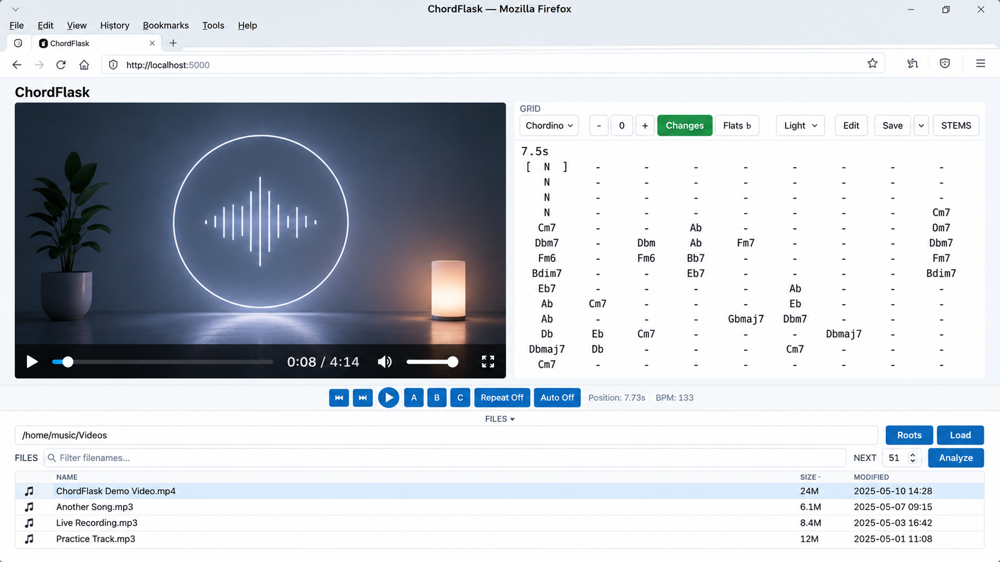

# ChordFlask

ChordFlask is for exploring your own music collection — audio and video — with chords. Browse your
audio tracks and music videos, play whatever catches your interest, and analyze only the pieces you
want. Completed analyses stay available, so your collection gradually becomes a reusable
chord-and-beat library without having to process everything up front.



ChordFlask is a free, self-hosted Linux chord analysis tool for local audio and video
collections. It analyzes chords and beats in MP3, MP4, and WebM files, supports
fast on-demand and batch analysis, and shows the results in sync while you play
the media in the browser. The displayed chords can be transposed, corrected,
compared, and exported as Markdown or PDF. Everything runs locally; media and
analysis data are never uploaded.

ChordFlask supports Linux x86_64 on Ubuntu 24.04+, Linux Mint 22+, and Debian
13+ (CPython 3.12 and 3.13). Native Windows is not supported; Windows users can run
ChordFlask under WSL2 (tested) and open the local web interface from the
Windows browser at localhost.

<!-- standalone-download:start -->
## Download

A prebuilt Linux x86_64 bundle is available for users who do not want to
build ChordFlask themselves:

**[Download chordflask-mint22-x86_64-py3.12-v0.9.7.tar.gz](https://github.com/bkl2000/chordflask/releases/download/v0.9.7/chordflask-mint22-x86_64-py3.12-v0.9.7.tar.gz)**

Built from the same ChordFlask release source as the public release. FFmpeg and
Vamp plugin binaries are not bundled; see the portable bundle guide for
requirements.
<!-- standalone-download:end -->

## Quick start

This is the recommended installation method. On a fresh Debian 13 or WSL2
system the Python interpreter, compiler toolchain, and download tools are not
preinstalled, so install the system packages first:

```bash
sudo apt update
sudo apt install --no-install-recommends \
  git curl ffmpeg pkg-config vamp-plugin-sdk python3-venv python3-dev \
  build-essential libasound2-dev libcairo2-dev
```

Download ChordFlask, create its private Python environment, install the two
required audio-analysis plugins, and start it:

```bash
git clone https://github.com/bkl2000/chordflask.git
cd chordflask
make setup-runtime
make plugins
scripts/chordflask
```

Open <http://localhost:5000> and use **Browse** to select a directory with
MP3, MP4, or WebM files. Stop ChordFlask with `Ctrl+C` in the terminal.

The Make targets use `~/.venvs/chordflask` automatically; you do not need to
activate that environment. If a command fails, see
[Troubleshooting](#troubleshooting).

## Why ChordFlask

ChordFlask is a small local-first tool for working with a music collection you
already have. Its emphasis is the workflow around chord analysis rather than a
claim of uniquely accurate recognition: browse a directory, play any file, and
generate reusable chord data only when it is useful.

Compared with hosted services such as Chordify, ChordFlask takes a different
trade-off: it is free, runs locally, works directly with your own audio and
video collection, and is designed for fast on-demand and batch processing.
Chord recognition quality is generally lower than mature commercial services,
so the generated chords should be treated as an approximate starting point
rather than an authoritative transcription.

It is especially useful for playing along or improvising with songs from your
own collection without searching for separate chord sheets or tabs.

This local, on-demand workflow is the main reason ChordFlask exists:

- prepare selected parts of a collection in bounded background batches;
- keep each completed analysis beside the media for later sessions; and
- continue browsing and playing while other files are analyzed.

**Automatic chord transcription is approximate, especially with dense mixes or
unusual harmony.** The current Chordino-based result is intended as a useful
starting point for orientation and practice, not as an authoritative score.
When the result is close enough, this workflow can avoid repeated manual setup.
When it is not, the original remains intact while an Edited version can be
corrected beat by beat.

## Using ChordFlask

### Command-line tools

ChordFlask provides a player and a small set of command-line tools.
Chordino is the built-in, default analyzer.

| Command | Purpose |
| --- | --- |
| `chordflask` | Interactive player |
| `chordflask-analyze` | Generate chord/beat analysis |
| `chordflask-demucs` | Generate optional stems |
| `chordflask-export` | Export analysis data |
| `chordflask-maintain` | Inspect/clean generated data |

The two supported setups are intentionally different:

**Source / virtualenv**

```bash
make all
cp scripts/chordflask scripts/chordflask-{analyze,demucs,export,maintain} ~/bin/
```

Then run `chordflask` from any directory (once `~/bin` is on your `PATH`). The
source launchers locate the configured ChordFlask virtual environment
themselves, so activating the venv is not normally required.

**Standalone bundle**

Unpack the release archive and run the launcher that ships beside the binary:

```bash
tar -xzf <release-archive>
cd <standalone-dir>
./install_vamp.sh
./chordflask.sh
```

`./chordflask.sh` launches the sibling `./chordflask` binary. See
[docs/STANDALONE.md](docs/STANDALONE.md) for the complete workflow.

In a source checkout the same commands are also available under `scripts/`:

```bash
# Start the player / web app
scripts/chordflask

# Analyze with the built-in Chordino analyzer
scripts/chordflask-analyze song.mp4
scripts/chordflask-analyze /music/videos

# Preview without changing anything, or replace an existing analysis
scripts/chordflask-analyze --dry-run /music/videos
scripts/chordflask-analyze --replace song.mp4

# Export leadsheets (Markdown and/or PDF)
scripts/chordflask-export song.mp4
scripts/chordflask-export --format markdown song.mp4
scripts/chordflask-export --format pdf song.mp4

# Maintenance
scripts/chordflask-maintain doctor
scripts/chordflask-maintain validate /music/videos
scripts/chordflask-maintain migrate-schema /music/videos
scripts/chordflask-maintain storage report /music/videos
```

Details are in [docs/ANALYSIS.md](docs/ANALYSIS.md) (analysis and export),
[docs/MAINTENANCE.md](docs/MAINTENANCE.md) (maintenance), and
[docs/HELPERS.md](docs/HELPERS.md) (the underlying helper modules).

### Optional BTC analyzer

Chordino is the built-in default analyzer. The optional BTC analyzer runs a
pretrained model in a separate environment and adds its result as an
additional `btc` chord track, without touching the Chordino track. Install and
use it explicitly:

```bash
make setup-btc BTC_ACKNOWLEDGE_WEIGHTS=1   # one-time: environment + model download
make btc-check                             # diagnose the runtime (CPU/CUDA, model)

scripts/chordflask-analyze --analyzer btc song.mp4
```

Chordino and BTC are stored as separate tracks; switch between them with the
track selector next to the chord grid. BTC never replaces Chordino and is not
part of the portable bundle.

### Optional Demucs stems / karaoke & practice

Demucs is an optional, separate runtime that splits a song into four parts —
**Vocals**, **Drums**, **Bass**, and **Other**. ChordFlask works normally
without it, and the normal app and portable bundle stay Demucs/Torch-free.

**Quick start**

```bash
# one-time optional environment setup
make setup-demucs
make demucs-check

# prepare every supported song in one directory (run once)
scripts/chordflask-demucs ~/Music
```

Then start ChordFlask normally and load one of the processed songs. ChordFlask
finds the generated stem data automatically and shows a small **STEMS**
control:

```text
[STEMS]  [Voc | 100] [Drm | 100] [Bass | 100] [Oth | 100]
```

- **STEMS** switches the player to separated audio. The original audio (and
  video) stays the master timeline; the four FLAC stems follow it.
- Click a stem name (**Voc** / **Drm** / **Bass** / **Oth**) to mute or unmute
  it. For example, muting **Voc** leaves a karaoke backing track; muting
  **Bass** is useful for bass practice.
- Click a percentage to open the single shared volume slider for that stem.
- Mixer state is kept while STEMS is switched OFF and ON again for the same
  song; loading a different song resets all four to 100%.

For STEM playback, Chromium/Chrome is the recommended browser. The current
multi-stream synchronization behavior is tested primarily with Chromium;
Firefox may be less reliable, especially when ChordFlask is accessed from
another device over the LAN.

Demucs preparation is **not** run automatically by the player — you normally
run the preparation command once for a music directory. The generated FLAC
stems stay beside that collection under `.chordflask/` and are registered as
one `audio_tracks["demucs:htdemucs"]` (`htdemucs`) set with the four stems
`bass`, `drums`, `other`, and `vocals`; the player just finds and uses them.
Re-running the command reports `CURRENT` for songs that are already prepared
instead of separating them again.

```bash
scripts/chordflask-demucs --dry-run ~/Music   # preview without processing
scripts/chordflask-demucs --replace song.mp3  # regenerate one stale set
```

See [docs/DEMUCS.md](docs/DEMUCS.md) for the complete workflow, storage
layout, and limitations.


### First use

1. Select **Browse** and navigate to a directory containing MP3, MP4, or WebM
   files. You can still enter an absolute path directly.
2. Select a file from the list. MP3 files use the compact audio player; videos
   use the video player.
3. ChordFlask queues missing analysis automatically. The status above the chord
   grid shows whether analysis is running, waiting, or failed.
4. To prepare several files, set **Next** to the desired batch size (50 by
   default) and select **Queue next**. Each click adds that many new,
   unanalysed files from the currently filtered and sorted list; files already
   analysed or queued do not consume the limit.
5. Use **Previous**, **Next**, **Repeat**, **Auto**, and **Transpose** while
   playing the file. Press **A** and **B** to mark a loop segment and **⟳** to
   repeat it.

Responsive layouts for desktop, tablet and smartphone are included. Mobile
support is functional but still undergoing broader real-device testing.

To use ChordFlask from a phone or tablet on the same trusted LAN, start
ChordFlask on the host with an allowed media root and a LAN listener:

```bash
chordflask --listen 0.0.0.0 --roots "/home/user/Music"
```

Then open `http://<host-ip>:5000` on the other device. ChordFlask has no
authentication or TLS, so LAN access should only be enabled on a trusted
network. See [Security](#security) for the media-root restrictions.

Different browsers and devices have independent playback and display state;
tabs in the same browser profile intentionally share one ChordFlask client
state. This state is held in memory and resets when ChordFlask restarts. Chord
edits, however, are shared files, so simultaneous edits to one song can give
one client a conflict; that client receives the current disk state and can
re-edit. This state separation is not authentication or hardened multi-user
isolation.

Generated JSON, MusicXML, MIDI, cached audio, and optional Demucs FLAC stems are stored in a
`.chordflask` directory beside the media. Your user therefore needs write
permission for the media directory. Existing media files are not modified.

ChordFlask also keeps a small application-state directory, `~/.chordflask`, in
your home folder. It holds the analysis queue, worker lock, and log files — not
your analysis results. The queue survives an application restart; interrupted
work is returned to the queue and incomplete temporary output is discarded on
retry.

### Batch leadsheet export

The `chordflask-export` command turns one media file or every supported media
file in a directory into matching playable Markdown and print-ready A4 PDF
leadsheets. Existing analyses are reused; missing files are analyzed serially
only when needed, so a second run costs no new analysis time.

```bash
scripts/chordflask-export ~/Music
scripts/chordflask-export song.mp4
```

Both files land beside the analysis as `.chordflask/<name>-chords-<track>.md`
and `.pdf`. Defaults are the Edited version when present (otherwise Chordino),
no transpose, Flats spelling, and repeated-chord `changes` mode:

```bash
# Sharps spelling and two semitones up
scripts/chordflask-export ~/Music --sharps --transpose 2

# The unedited Chordino version with every beat written out
scripts/chordflask-export ~/Music --chord-track original --repeat-mode chords

# Write only one format
scripts/chordflask-export ~/Music --format markdown
scripts/chordflask-export ~/Music --format pdf
```

The browser **Save** button downloads one ZIP containing the matching `.md` and
`.pdf` for the single file currently displayed. Full format and option details
are in [docs/ANALYSIS.md](docs/ANALYSIS.md).

### Analysis storage and cleanup

Each analyzed directory owns an independent `.chordflask` subdirectory holding
its analysis JSON, cached audio, and exports. A read-only report shows how much
space one directory uses:

```bash
scripts/chordflask-maintain storage report /path/to/music
```

Cleanup is explicit and non-recursive, limited to one directory. For example,
remove cached audio that ChordFlask can regenerate from video sources:

```bash
scripts/chordflask-maintain storage cleanup /path/to/music --cached-audio
```

Cleanup can also remove orphaned temporary work and corrupt-analysis backups
(using an explicit retention age). Valid analysis JSON, source media, and
user-edited chords are never deleted. See [docs/ANALYSIS.md](docs/ANALYSIS.md)
for the complete storage description.

## Build a portable Linux bundle

A prebuilt bundle is available from [Download](#download) above. This advanced
workflow builds ChordFlask on your machine for use on a compatible Linux x86_64
machine. It is not required for normal use.

```bash
make setup
make standalone
```

The transferable archive is named after the build machine's distro, CPU
architecture, Python version, and ChordFlask version, for example:

```text
flask/dist/chordflask-debian13-x86_64-py3.12-v0.6.3.tar.gz
```

Test the unpackaged build locally with `make standalone-run`. The archive does
not contain FFmpeg or Vamp plugin binaries. After copying it to the target
machine, follow [the complete standalone guide](docs/STANDALONE.md). The same
guide is included as `README.md` inside the archive.

## Troubleshooting

- **`ffmpeg` was not found:** run `sudo apt install ffmpeg` and restart.
- **Vamp plugins are missing:** run `make plugins` from the source directory and
  restart. In an unpacked portable bundle, run `./install_vamp.sh` instead.
- **No files appear:** load an existing directory and check that its files end
  in `.mp3`, `.mp4`, or `.webm`.
- **Analysis cannot write files:** give your user write permission for the media
  directory so ChordFlask can create `.chordflask`.
- **Inspect analysis storage:** run
  `scripts/chordflask-maintain storage report /path/to/music` (read-only) to
  see how much space one directory's local `.chordflask` uses.
- **Port 5000 is busy:** start on another port — source:
  `scripts/chordflask --port 5050`; standalone:
  `./chordflask.sh --port 5050` — and open <http://localhost:5050>.

## Security

ChordFlask has no authentication, TLS, or CSRF protection. Keep the default
`127.0.0.1` listener unless every device on the network is trusted. Read
[SECURITY.md](SECURITY.md) before enabling LAN access.

A LAN listener requires at least one allowed media root. Use `--listen` to
select the bind address/interface, `--port` to select the TCP port, and
`--roots` to select the allowed media roots:

```bash
chordflask --listen 0.0.0.0 --roots "/home/user/Music"
```

Separate multiple roots with the platform path separator (`:` on
Linux/macOS, `;` on Windows):

```bash
chordflask --listen 0.0.0.0 --roots "/home/user/Music:/mnt/media/videos"
```

For scripts and services, set the `CHORDFLASK_MEDIA_ROOTS` environment
variable instead (the older `CHORDIFIER_MEDIA_ROOTS` spelling is still
accepted for compatibility). The command-line option takes precedence over
both.

Only media below these roots is served on the network. The home directory or
the whole filesystem is not automatically exposed.

## More documentation

- [Architecture and developer map](docs/ARCHITECTURE.md)
- [Playback, analysis tracks, and chord display](docs/ANALYSIS.md)
- [Maintenance commands](docs/MAINTENANCE.md)
- [Supported command-line helpers](docs/HELPERS.md)
- [Vamp plugin installation and verification](docs/VAMP.md)
- [Portable bundle guide](docs/STANDALONE.md)
- [Platform and Python compatibility](docs/COMPATIBILITY.md)
- [Optional Demucs stems and playback](docs/DEMUCS.md)
- [Development and tests](CONTRIBUTING.md)

## Development transparency

ChordFlask has been and continues to be developed through a maintainer-led,
AI-assisted "vibe coding" workflow. The maintainer defines, leads, and reviews
all changes and retains the testing and release decisions. AI coding tools
assist with development but are not authors, maintainers, partners, or
endorsers of the project.

## License

ChordFlask-owned source is available under the MIT License. FFmpeg, Vamp
plugins, and Python dependencies retain their own licenses. See [LICENSE](LICENSE)
and [THIRD_PARTY_NOTICES.md](THIRD_PARTY_NOTICES.md).

ChordFlask is independent of and not endorsed by the Pallets project, which
maintains Flask.
